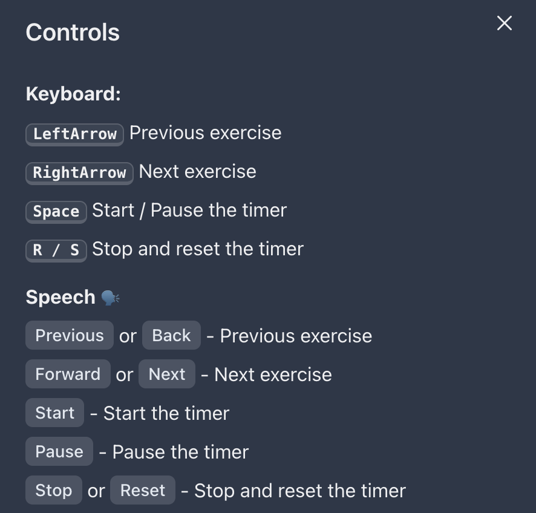

## Exercise studio 
[Live demo](https://patrikniebur.github.io/exercise-studio/)

Experiment using [`SpeechRecognition` API](https://developer.mozilla.org/en-US/docs/Web/API/SpeechRecognition) (which currently appears to work only in latest Chrome `v116`) and [`FileSystem` API](https://developer.mozilla.org/en-US/docs/Web/API/File_System_API).  

Purpose of the app is to organise exercise routine from the images of exercises in your local file system. After giving browser access to the folder it will read the images, allow you to add text instructions, reorder them using drag and drop and then run the exercise routing which can be controlled by voice. To see what voice commands work click the `?` button in the top left corner of the exercise routine screen or see the image below:  

### Development  
**Requirements**  
`node` tested in latest version 19.8.1 and `npm`.  
**Setup**  
Run `npm install` and `npm start` to run the local server with HMR

